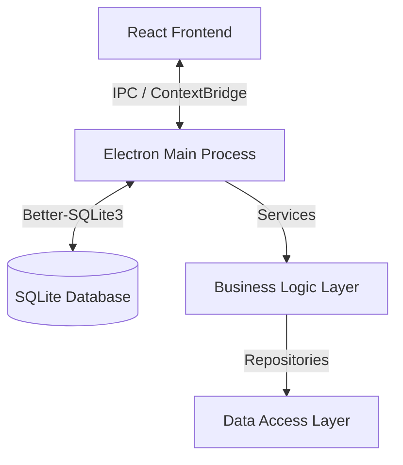

# Architecture Overview

Mwingi School ERP follows a modular architecture using **Electron**, **React**, and **SQLite**.

## High-Level Diagram



## Key Technology Stack

- **Runtime**: Electron (Chromium + Node.js)
- **Frontend**: React, TypeScript, Tailwind CSS
- **State Management**: Zustand
- **Database**: SQLite (via `better-sqlite3`)
- **Build Tool**: Vite

## Project Structure

```
root/
├── electron/
│   ├── main/           # Main process code
│   │   ├── services/   # Business logic (PaymentService, etc.)
│   │   ├── ipc/        # IPC Handlers definition
│   │   └── database/   # Schema migrations & helpers
│   └── preload/        # Context Bridge exposure
├── src/                # React Frontend
│   ├── components/     # Reusable UI components
│   ├── pages/          # Application views
│   └── stores/         # Zustand state stores
├── docs/               # Project documentation
└── tests/              # E2E & Unit tests
```

## Service Layer Pattern

We use a Service-Repository pattern to decouple business logic from the database and UI.

1. **Services**: Handle validation, complex calculations, and multiple repository calls (transactional boundaries).
2. **Repositories** (Optional): Direct database queries. In simple cases, Services facilitate direct DB access.
3. **IPC Handlers**: Controllers that map IPC events to Service methods.

## Security

- **Context Isolation**: Enabled (`contextIsolation: true`)
- **Node Integration**: Disabled in Renderer (`nodeIntegration: false`)
- **Content Security Policy**: Applied via `electron-builder` and HTML meta tags.
